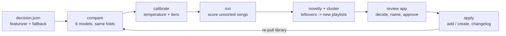

# Playlist Sorter — Phase 2: The Product

_Last updated: 2026-10-02 · Owner: Ahmad · Builds on [PRD1.MD](PRD1.MD)_

## Overview

Phase 2 turns the Phase 1 song vectors into the product: every liked song that isn't in a playlist gets
ranked playlist suggestions, songs that fit nowhere become candidate new playlists, and a local review app
writes only the changes you approve back to Spotify.

Phase 1's experiments have not been run on the real library yet, so nothing here hard-codes a featurizer.
The product reads the winner from `data/decision.json` (written by `python -m src.decide` from
`experiments.csv`), or takes `--config` by hand.

## Pipeline

| Step | Module | What it does |
| --- | --- | --- |
| Featurizer choice | `src/decide.py` | PRD1 rules: ≥ 2x E0 top-1 on every fold, simplest within one std of the best top-3, Essentia over CLAP on ties; names a fallback if coverage < 90% |
| Spaces | `src/sorter/spaces.py` | Winner first, fallback second; each song is scored in the first space that covers it, by a model trained in that space |
| Assignment models | `src/sorter/models.py` | centroid, LDA (shrunk shared covariance), Mahalanobis (per-playlist covariance shrunk to shared), kNN-10/25, label spreading. NumPy by hand, like `src/linalg.py` |
| Model choice | `src/sorter/compare.py` | Same 5 folds as Phase 1; first model in preference order within one std of the best on top-3, top-1 **and** macro-F1; logs `models.csv` |
| Calibration | `src/sorter/calibrate.py` | Temperature softmax fit on out-of-fold NLL; *confident* threshold = 90% held-out top-1 precision; *abstain* threshold where held-out top-3 falls under 50% |
| New-music detection | `src/sorter/novelty.py` | Anchored k-means: playlist centroids fixed, free centers fit to the backlog; a free center must beat the gain spurious centers reach on held-out sorted songs |
| Leftover clusters | `src/sorter/cluster.py` | Spherical k-means, k by cosine silhouette, clusters under 8 songs dissolved |
| Vibes and names | `src/sorter/describe.py` | Distinctive Last.fm tags (share × log lift), Essentia mood axes as z-scores, top Discogs style, top artists, decade |
| Review | `src/sorter/review.py`, `src/app/` | Decisions in `data/review.json`; keyboard-driven web UI on 127.0.0.1 |
| Write-back | `src/sorter/apply.py` | Feb 2026 endpoints; only adds and creates private playlists; changelog per apply; undo |

## Decisions and why

**Featurizer stays an input, not a constant.** PRD1's exit criterion hasn't been met on real data. `decide`
encodes PRD1's rules so the moment the experiment log is filled, the product picks it up.

**Neighbour-vote models are last in preference.** On the synthetic library with small playlists, kNN-10
scored 97% top-1 in cross-validation but 78% on the actual backlog; centroid and LDA held at 93%. The backlog
is not spread over playlists in the same proportions as your sorted songs (label shift), and vote-based models
swamp small playlists. CV on sorted songs can't see this, so kNN / label spreading only win when clearly
better. Macro-F1 is part of the choice rule for the same reason. EM prior re-estimation (Saerens et al.)
was tried and made it worse (top-3 93% → 80%): vote posteriors are too sharp for it.

**A song can be "new", not just "unsure".** A model always spreads probability over existing playlists, so
low confidence alone missed most songs from genres you have no playlist for. A nearest-neighbour similarity
threshold caught ~1/4; anchored k-means catches ~9 in 10 on the demo. Spare free centers find the edges of
real playlists, so each must out-gain what spurious centers reach on held-out sorted songs.

**Nothing destructive, everything undoable.** Apply only adds songs and creates private playlists. Every
apply writes `data/applied/<timestamp>.json`; undo removes exactly those songs and unfollows created
playlists. Decisions are stamped as each request lands, so a crash halfway is safe to re-run.

**Spotify API as of Feb 2026.** Reads and writes use `/playlists/{id}/items` (the `/tracks` paths are gone
for Development Mode apps), playlists are created with `POST /me/playlists`, and undo unfollows with
`DELETE /me/library`. Only playlists you own or collaborate on return contents, so only those are pulled
and only those are writable. Track `external_ids` (ISRC) is no longer returned, so iTunes matching uses
artist + title + duration.

## Results on the synthetic library

The demo (25 playlists of which 18 are scored, 3,000 songs, 3 hidden genres in the backlog) checks the
pipeline end to end:

| Check | Result |
| --- | --- |
| Chosen model | LDA (top-1 93.3 ± 1.0%, top-3 99.0 ± 0.3% held out) |
| Backlog songs that belong in an existing playlist | top-1 96%, top-3 100% |
| Confident-tier precision (target 90%) | 97% over 585 songs |
| Hidden-genre songs routed to leftovers | 92% |
| Leftover clusters | 3, each 68–84% one hidden genre, named "Japanese · 80s", "Bossa Nova · Brazilian", "Fast · Jungle" |

These numbers say the plumbing is right, not what real accuracy will be. Real playlists defined by era or
context ("2019 summer") will score lower; PRD1's risk table still applies.

## Before going live

1. Fill `.env` and run M1 (`python -m src.fetch.spotify`); check how many playlists have ≥ 10 songs.
2. Run E0 → E1b and `python -m src.decide`. Tags alone may be enough to start.
3. `python -m src.sorter.run`, then look at `models.csv` and the tier counts before trusting "Accept all confident".
4. Apply a small batch first, check it in Spotify, then try undo once so you know it works on your account.

## Open questions

| Question | Why it matters | Next step |
| --- | --- | --- |
| Does the confident tier hold 90% on real data? | Bulk accept relies on it | Spot-check 30 confident songs before the first bulk accept |
| Small playlists (< 10 songs) can't receive suggestions | Their backlog songs end up in clusters | The cluster view shows top artists; consider lowering `MIN_PLAYLIST_SIZE` to 5 for the sorter only |
| Should rejected suggestions feed back? | Skips are signal (a song is *not* that playlist) | Re-running after a re-pull already learns from accepted songs; negatives would need a model change |
| Songs that already sit in the wrong playlist | Out of scope here | Same scores could flag sorted songs whose own playlist ranks low |
