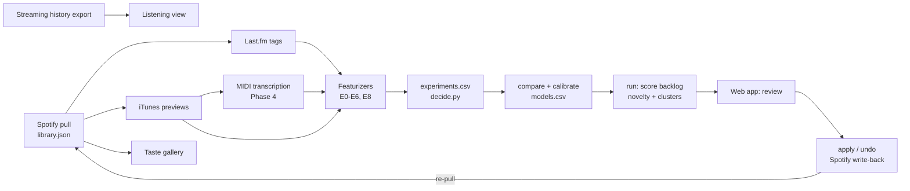
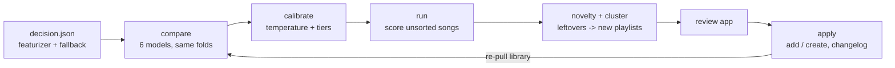
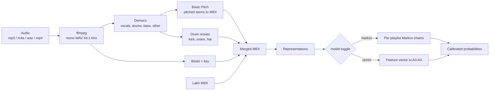

# Spotify Refine — Product Requirements (all phases)

_Last updated: 2026-10-09 · Owner: Ahmad · Repo: [AhmadWali04/Spotify_Refine](https://github.com/AhmadWali04/Spotify_Refine)_

> This document replaces `PRD1.MD`, `PRD2.MD` (a duplicate of PRD1), `PHASE2.md` and `PRD3.MD`. It records
> what was built, why, where it stands on real data, and what is left. The README stays the how-to-run guide.

---

## 1. Overview

Spotify Refine uses machine learning to sort a messy Spotify **Liked Songs** library (~3,000 songs) into
existing playlists. It learns what each playlist sounds like from the songs already in it, suggests a
playlist for every liked song that isn't in one, groups songs that fit nowhere into candidate new
playlists, and lets you review everything in a local web app before anything is written to Spotify.

| Phase | What it delivers | Status |
| --- | --- | --- |
| **1 — Song vectorization** | A measured choice of how to turn a song into a vector (E0–E6) | Loop built; on real data only E0 and E1b have run; audio methods not run |
| **2 — The sorter** | Assignment models, calibration, new-music detection, clusters, review, safe write-back | Built and run on real data (E1b space); nothing applied to Spotify yet |
| **3 — Web app** | Spotify login, pipeline from the browser, review flow, Listening view, Taste gallery | Built; Listening view not yet committed |
| **4 — MIDI analysis** | Symbolic (MIDI) featurizer, Markov / vector models, fusion with the current best | M13–M16 done (Lakh benchmark, both models); M17 transcription built and S6 gap measured; M18–M19 left |

### 1.1 Where things stand on the real library (2026-10-04 pull)

| Item | Value |
| --- | --- |
| Liked songs / playlists / playlists with ≥ 10 songs | 3,005 / 26 / 23 |
| Last.fm tag rows | 38,035 |
| Audio previews fetched | 0 (E2–E6 blocked on this) |
| Featurizer in use | E1b-k100 (tags + LSA), the default because `data/decision.json` doesn't exist yet |
| Chosen assignment model | Label spreading: top-1 **58.5 ± 1.7%**, top-3 **80.2 ± 2.7%**, macro-F1 0.40 (1,777 songs, 23 playlists; chance ≈ 4% / 12%) |
| Calibration | T = 0.109; confident threshold 0.91 covers 24% of held-out songs at 90% precision |
| Suggestions for the backlog | 209 confident · 1,452 suggested · 64 leftover · 92 no data · 3 new-playlist clusters |
| Review / apply | 6 decisions made; no apply to Spotify yet |
| Streaming history imported | 437,558 plays |

---

## 2. Constraints

Spotify no longer provides song features, so every vector is computed from outside sources.

- **Audio features are gone.** Spotify removed `audio-features`, `audio-analysis` and `recommendations` for new apps on 27 Nov 2024.
- **Development Mode (Feb 2026).** The app owner needs Premium; one Client ID per developer; max 5 authorized users, added on the dashboard.
- **Redirect URI** must use `127.0.0.1`, not `localhost` (`http://127.0.0.1:8888/callback`).
- **Feb 2026 endpoints.** Reads and writes use `/playlists/{id}/items` (the `/tracks` paths are gone for Development Mode apps). Playlists are created with `POST /me/playlists`, and undo unfollows with `DELETE /me/library`. Only playlists you own or collaborate on return their contents, so only those are pulled or writable. Track `external_ids` (ISRC) is no longer returned.
- **No audio from Spotify.** Clips come from iTunes 30-second previews, matched on artist + title + duration. They are rate-limited to ~25 requests/min, so ~3,000 songs take about 2 hours across resumable runs.
- **Recent plays only.** The API returns only the last 50 plays; listening history comes from the user's data export.
- **Local compute only.** Everything runs on a laptop and is cached to disk, keyed by Spotify track ID, so no song is processed twice.

---

## 3. System at a glance



---

## 4. Phase 1 — Song vectorization

**Goal:** choose how to turn a song into a vector **x**, by measured experiment rather than guess. Every
later step depends on vector quality.

### 4.1 Candidate featurizers

Run cheapest first; E4–E6 only if single-source methods leave a clear gap.

| ID | Method | Vector x | Dims | Audio? | Linear-algebra angle |
| --- | --- | --- | --- | --- | --- |
| E0 | Random baseline | Random Gaussian | 64 | No | Chance-level floor |
| E1 | Last.fm tags, TF-IDF | Weighted tag counts, smooth idf, L2 rows | 500–2,000 | No | Sparse vectors, cosine geometry |
| E1b | Tags + LSA | Truncated SVD of song × tag TF-IDF | 50–100 | No | SVD merges synonym tags |
| E2 | Essentia classifiers | Mood probs, danceability, valence, arousal, genre/style probs | ~410 | Yes | Interpretable axes |
| E3 | CLAP embedding | Dense audio embedding | 512 | Yes | Text-prompt directions (happy − sad) |
| E4 | Concatenation | [E1b ; E2 ; E3], each block z-scored, scaled 1/√(block size) | ~670 | Yes | Block weighting |
| E5 | Concat + PCA | E4 on top k components | 20–100 | Yes | Explained variance, denoising |
| E6 | Interactions | E4 + mood × top-genre outer products | E4 + ~50 | Yes | Rank-1 terms |
| E8 | Symbolic (MIDI) | See Phase 4 | varies | Yes | Markov chains / transition matrices |
| E9 | Fusion E8 + best | softmax(w₁ log p_sym + w₂ log p_best) | — | Yes | Weights fit by held-out NLL |

### 4.2 Experiment loop and rules

`python run_experiment.py --config configs/<run>.yaml`. Each run featurizes (cached), builds X, does a 5-fold
evaluation, appends a row to `experiments.csv`, and saves a PCA plot.

- **Same data, same splits:** folds fixed once per library pull (`data/folds.json`, seed 42).
- **Same scorer:** nearest-centroid cosine (primary) and kNN-10 (second view). Phase 1 compares vectors, not models.
- **One change per run:** each variant gets its own run ID (`E1b-k50`).
- **Labeled set:** songs already in ≥ 1 playlist; playlists with < 10 songs are not scored. A multi-playlist song is correct if any of its playlists is predicted.

$$
\text{score}(x, p) = \frac{x \cdot \mu_p}{\lVert x \rVert \lVert \mu_p \rVert}, \qquad \mu_p = \frac{1}{|p|}\sum_{i \in p} x_i
$$

| Metric | Role |
| --- | --- |
| Top-1, top-3 accuracy | Primary |
| Macro-F1, silhouette | Secondary |
| Coverage of liked songs | Gate (≥ 90% or a named fallback) |
| Featurize time, vector size | Tiebreak |

### 4.3 Decision rules (encoded in `src/decide.py`)

1. **Beat baseline:** top-1 ≥ 2× E0 on all 5 folds.
2. **Simplest within one fold-std of the best top-3:** fewer sources, then smaller vectors, then faster.
3. **Explainable wins ties:** E2 over E3 (named mood/genre axes make playlist vibes readable).
4. **Coverage:** if the winner covers < 90% of liked songs, name a fallback (usually tags) for the rest.

Output: `data/decision.json` and `reports/decision.md`. Until it exists, the sorter uses E1b-k100.

### 4.4 Status

| Run | Status on real data |
| --- | --- |
| E0, E1b-k100 | Vectors cached; `experiments.csv` is missing from the repo, so they need re-running to be logged |
| E1, E1b-k50 | Not run |
| E2, E3 | Blocked: iTunes previews not fetched; Essentia/CLAP installs unchecked |
| E4–E6 | Not run (only if E1–E3 leave a gap) |
| `decide` | Not run on real data |

---

## 5. Phase 2 — The sorter

**Goal:** every unsorted liked song gets ranked playlist suggestions. Songs that fit nowhere become
candidate new playlists, and only the changes you approve are written back.

### 5.1 Pipeline



| Step | Module | What it does |
| --- | --- | --- |
| Spaces | `src/sorter/spaces.py` | Winner first, fallback second; each song is scored in the first space that covers it |
| Assignment models (A0–A4) | `src/sorter/models.py` | A0 centroid, A1 LDA (shrunk shared covariance), A2 Mahalanobis (per-playlist covariance shrunk to shared), A3 kNN-10/25, A4 label spreading. Hand-written NumPy |
| Model choice | `src/sorter/compare.py` | Same 5 folds; first model in preference order within one std of the best on top-3, top-1 **and** macro-F1; logs `models.csv` |
| Calibration | `src/sorter/calibrate.py` | Temperature softmax fit on out-of-fold NLL. **Confident** = 90% held-out top-1 precision; **abstain** where held-out top-3 < 50% |
| New-music detection | `src/sorter/novelty.py` | Anchored spherical k-means: playlist centroids fixed, free centers fit to the backlog; each free center must beat the gain spurious centers reach on held-out sorted songs |
| Leftover clusters | `src/sorter/cluster.py` | Spherical k-means, k by cosine silhouette, clusters < 8 songs dissolved |
| Vibes and names | `src/sorter/describe.py` | Distinctive tags (share × log lift), Essentia mood z-scores, top style, artists, decade |
| Review | `src/sorter/review.py` | Decisions in `data/review.json` |
| Write-back | `src/sorter/apply.py` | Adds songs and creates private playlists only; changelog per apply; undo |

**Tiers:** confident · suggested · leftover (low confidence or new kind of music → clusters) · no data.

### 5.2 Key decisions and why

- **The featurizer is an input, not a constant.** `decide` encodes the Phase 1 rules, so filling the experiment log updates the product automatically.
- **Neighbour-vote models come last in preference.** On the synthetic library, kNN-10 scored 97% in cross-validation but 78% on the actual backlog, while centroid and LDA held at 93%. The cause is label shift: the backlog isn't spread over playlists in the same proportions as sorted songs, and vote-based models swamp small playlists. So kNN and label spreading must be clearly better to win, and macro-F1 is part of the rule. EM prior re-estimation (Saerens et al.) made this worse (top-3 93% → 80%).
- **A song can be "new", not just "unsure".** Low confidence alone missed most songs from genres with no playlist. A nearest-neighbour threshold caught ~1/4; anchored k-means catches ~9 in 10 on the demo.
- **Nothing destructive, everything undoable.** Every apply writes `data/applied/<timestamp>.json`; undo removes exactly those songs and unfollows created playlists. Decisions are stamped as each request lands, so a crash mid-apply is safe to re-run.

### 5.3 Results

**Synthetic library** (25 playlists, 18 scored, 3,000 songs, 3 hidden genres): LDA chosen (top-1 93.3%,
top-3 99.0%). Backlog top-1 96% / top-3 100%. Confident-tier precision 97% over 585 songs. 92% of
hidden-genre songs routed to leftovers. 3 clusters, each 68–84% one hidden genre. These numbers verify the
plumbing, not real accuracy.

**Real library** (E1b-k100, `models.csv`):

| Model | Top-1 | Top-3 | Macro-F1 | NLL | ECE |
| --- | --- | --- | --- | --- | --- |
| A0 centroid | 49.8 | 71.4 | 0.41 | 1.87 | 0.18 |
| A1 LDA | 55.4 | 77.6 | 0.47 | 1.64 | 0.18 |
| A2 Mahalanobis | 39.3 | 63.4 | 0.30 | 1.95 | 0.15 |
| A3 kNN-10 | 58.2 | 78.1 | 0.43 | 1.54 | 0.09 |
| A4 label spreading (**chosen**) | 58.5 | 80.2 | 0.40 | 1.52 | 0.13 |

---

## 6. Phase 3 — Web app

Flask API (`src/app/server.py`) plus a single-page vanilla JS + D3 front end (`src/app/static/`).
`python -m src.app` serves http://127.0.0.1:8888, including the OAuth callback.

| View | What you do there |
| --- | --- |
| Landing | Log in with Spotify (token in `.spotify_cache`, shared with the CLI) or open the demo library |
| Home | Run pull → tags → sort as background jobs (`src/app/jobs.py`) with progress and logs |
| Sort songs | One song at a time: preview, top-3 playlists with probabilities and their "vibe"; keys 1/2/3, N (new), S (skip), Z (undo); "Accept all confident" |
| New playlists | Leftover clusters with suggested names; rename, drop songs, choose which to create |
| Your playlists | Each playlist's learned vibe: distinctive tags, mood axes, top artists |
| Apply | Exact change list, apply button, undo for every previous apply; disabled for the demo |
| Listening | From the streaming-history export (`src/fetch/history.py`, `src/app/listening.py`): hours over time, genre mix donut, listening calendar, then-vs-now radar, artist chord diagram, overall taste radar |
| Taste gallery | Taste galaxy (PCA map), listening clock, time machine, genre DNA, artist orbit, playlist kinship; every chart has a table view |

A play's genre is its song's strongest Last.fm tag (else its artist's). The tags step also tags the 500
most-played artists with no tagged liked songs. One Spotify account at a time, since the app keeps one
library on disk.

---

## 7. Phase 4 — MIDI analysis and symbolic classifier

**Goal:** turn any song into MIDI, represent it as inspectable matrices and dataframes, and learn which
musical patterns (chord progressions, melodic motion, drum grooves) characterize each playlist. The symbolic
prediction is used alone (E8) or fused with the current best (E9). Sheet music and MusicXML were dropped:
quantization loses the timing feel (swing, groove) that carries genre information.

**Non-goals:** notation rendering, music generation, lyrics or vocal-timbre analysis, real-time transcription.

### 7.1 Success metrics

| Metric | Target |
| --- | --- |
| LMD genre top-1 (clean MIDI, 5-fold) | ≥ 2× majority-class baseline |
| Your playlists, top-3, symbolic only | ≥ 3× E0 |
| Fusion: symbolic + current best | Top-3 ≥ 80.2% + 2 points |
| Transcription gap | Measured: clean vs transcribed accuracy on the same LMD songs |
| Inspectability | Matrices + dataframes for any song in one command |

### 7.2 Pipeline



**Transcription (M17, built: `src/midi/transcribe.py`).** `python -m src.midi.transcribe song.m4a`, or
`--previews` for every iTunes clip. A 30 s clip takes ~5–15 s on an M-series Mac.

| Req | How it's done |
| --- | --- |
| FR-M1 | ffmpeg → mono 44.1 kHz 16-bit WAV |
| FR-M2 | Demucs `htdemucs` (CLI, MPS) → vocals / drums / bass / other in `data/stems/<id>/`; **deleted after transcription** unless `--keep-stems` (~20 MB per clip; 3,000 previews would need ~70 GB) |
| FR-M3 | Basic Pitch 0.4 (ONNX backend) per pitched stem, with per-stem frequency limits (bass 30–400 Hz, vocals 80–1100 Hz); instruments named `bass`, `other`, `vocals` |
| FR-M4 | Drums: spectral-flux onsets in three bands (kick < 150 Hz, snare 1–5 kHz, hat > 7 kHz), peak picking, then each onset sharpened on the band-filtered waveform. Weak peaks (< 30% of a band's typical hit) and weak peaks coinciding with a lower drum's hit (beater bleed) are dropped; hits on one drum < 60 ms apart merge. 80–100% recall/precision on synthesized loops at 80–150 bpm |
| FR-M5 | Beats: onset envelope → autocorrelation tempo (log-normal prior at 120 bpm) → Ellis dynamic-programming beat tracker, in NumPy (madmom doesn't install on Python 3.12). Downbeat = the beat phase with the most kicks. Key: Krumhansl–Schmuckler on the transcribed notes. Beats go into the MIDI tempo map (one quarter note per beat) and `<id>.json` |
| FR-M6 | `data/midi/<id>.mid` + `<id>.json` (tempo, key, beat times, note counts, seconds); a cached song is never re-transcribed |

Demucs and Basic Pitch are passed in as functions, so tests run the pipeline with stubs; the DSP parts
(beats, drums, assembly) are tested on synthesized audio with known ground truth.

### 7.3 Representations (built: `src/midi/represent.py`)

Time is on a 16th-note beat grid, so tempo doesn't change any matrix. Modeling matrices are key-relative
(tonic = 0). Key comes from the MIDI key signature when present, else Krumhansl–Schmuckler.

- **`notes_df`**: one row per note: track_id, instrument, program, is_drum, pitch, pitch_name, pitch_class (key-relative; −1 for drums), start_s, end_s, start_beat, duration_beats, bar, step_in_bar, velocity.
- **`beats_df`**: one row per beat: beat, bar, chord, chord_root, chord_quality, n_active_notes, chroma c0–c11, kick/snare/hat hits.
- **`summary_df`**: one row per song: tempo, key, mode, density, pitch range, syncopation, unique chords, and the flattened feature vector.

| Matrix | Shape | Definition |
| --- | --- | --- |
| `piano_roll` | 128 × T | Binary note activity per 16th step (pitched notes only) |
| `chroma` / `chroma_keynorm` | 12 × T | `F @ piano_roll`; key-normalized by circular shift |
| `chord_seq` | B | Per-beat chord, 0–23 major/minor, 24 = none (template cosine ≥ τ = 0.6) |
| `chord_trans` | 25 × 25 | Chord transition counts |
| `pc_trans` | 12 × 12 | Melody (top voice) pitch-class transitions |
| `interval_hist` | 25 | Melodic intervals −12…+12 |
| `drum_grid`, `drum_grid_var` | 3 × 16 | Mean / variance of kick-snare-hat per step across bars |
| `ssm` | bars × bars | Cosine self-similarity of bar chroma |
| `chroma_dft_mag` | 7 | Key-free DFT magnitude of mean chroma |

**Inspect:** `python -m src.midi.inspect song.mid` (or `--synthetic jazz`) writes `data/inspect/<id>/`:
`notes.csv`, `beats.csv`, `summary.csv`, `matrices.npz`, five PNGs and `transcribed.mid`. It also prints
the first notes, key, tempo and top chord changes.

### 7.4 Models (built: `src/models/symbolic/`)

One interface (`fit(songs, labels)`, `scores`, `predict_proba`); `model:` in `configs/symbolic.yaml` picks
which one runs, with CLI overrides `--symbolic-model` and `--assignment`.

**Markov (generative).** Per playlist p and sequence type s (chords K = 25, pitch classes K = 12, drum
states K = 8), order 1 or 2:

$$
P_{p,s}(j \mid i) = \frac{n_{p,s}(i \to j) + \alpha}{\sum_k n_{p,s}(i \to k) + K_s\alpha}, \qquad
\ell_p = \sum_s w_s \frac{1}{T_s}\sum_t \log P_{p,s}(x_{t+1}\mid x_t) + \log\pi_p
$$

`explain()` lists the song's transitions with the largest log P_p − log P_background (e.g.
"vi → IV is 4× more common here"), which feeds the app's "why" view.

**Vector (discriminative).** Flatten the blocks (transition matrices row-normalized), z-score with training
stats, scale each block by 1/√size, apply optional PCA, then run any of A0–A4. Optional transposition
augmentation adds every training song in all 12 keys.

**Calibration and fusion.** Both modes go through the existing temperature scaling. E9 fuses symbolic and
current-best log-probabilities with weights fit by held-out NLL.

### 7.5 Datasets

| Dataset | Use |
| --- | --- |
| Synthetic MIDI (`src/midi/synthetic.py`, 5 genres) | Plumbing tests; too easy (tempo and drums give genres away) to judge models |
| LMD-matched + tagtraum **CD2** (majority genre) | Built by `src/data/lakh.py`. 31,034 matched MSD tracks, 9,430 with a CD2 label (CD2C would give 6,180). Best match per track only; dropped: unreadable 33, no tempo events 6, < 30 s 5, no pitched notes 4. Capped at 400 per genre; Punk dropped (29 < 60). **Frozen: 3,294 songs, 14 genres, 5 stratified folds** in `data/lmd/subset.csv` |
| LMD synthesized to audio | FluidSynth + GeneralUser GS soundfont, 30 s excerpts (s 30–60), all drum tracks on the Standard kit (LMD names kits the soundfont lacks, which render silent) |
| Your playlists (previews / own files) | The real task, same folds as Phase 1 |

### 7.6 Experiments (`python -m src.midi.experiment`, logged to `symbolic.csv`)

| ID | Data | Model | Purpose | Status |
| --- | --- | --- | --- | --- |
| S0 | LMD | Majority + chance | Floor | Done |
| S1 | LMD | Markov, chords, order 1 | Baseline generative | Done |
| S2 | LMD | Markov, chords + melody + drums | Does rhythm/melody help? | Done |
| S3 | LMD | Markov, all three, order 2 | Context vs sparsity | Done (**best**) |
| S4 | LMD | Vector + A0 / A2 / A3 | Discriminative comparison | Done |
| S5 | LMD | S4-A2 without transposition augmentation | Value of key invariance | Done |
| S6 | LMD synth audio | S3 and S4-A0, transcribed | Transcription gap | Done |
| E8 | Your playlists | Best symbolic | Symbolic-only accuracy | Needs previews (M4) |
| E9 | Your playlists | Fusion E8 + current best | Does it improve the app? | Needs E8 |

`--suite` runs S1–S5. The input is `--data synthetic` or a CSV with `track_id, path, label[, fold]`. Every
row logs its full config and git hash. Synthetic results (plumbing only): S1 85% top-1, S2–S5 97–100%.

**Lakh results** (3,294 songs, 14 genres, 5-fold; `symbolic.csv`). Floor: majority 12.1% top-1, chance 7.1% / 21.4%.

| Run | Top-1 | Top-3 | Macro-F1 | NLL | ECE |
| --- | --- | --- | --- | --- | --- |
| S1 Markov chords, order 1 | 22.3 ± 1.3 | 45.4 | 0.18 | 2.40 | 0.06 |
| S2 + melody + drums | 26.2 ± 1.3 | 48.4 | 0.21 | 2.33 | 0.06 |
| **S3 order 2** | **29.5 ± 1.2** | **55.9** | **0.23** | **2.25** | 0.07 |
| S4-A0 vector, centroid | 25.0 ± 1.6 | 48.2 | 0.22 | 2.38 | 0.05 |
| S4-A2 vector, Mahalanobis | 24.0 ± 1.1 | 46.8 | 0.21 | 2.42 | 0.08 |
| S4-A3 vector, kNN-10 | 25.5 ± 1.8 | 45.4 | 0.21 | 2.42 | 0.04 |
| S5 = S4-A2 without augmentation | 24.3 ± 0.7 | 46.8 | 0.22 | 2.41 | 0.08 |

- **Success metric met:** S3 is 2.4× the majority baseline (target 2×). S1 alone is 1.8×.
- **Prior matters:** with a size-proportional prior the Markov runs funnel songs into big genres (S3: 26.0% top-1, F1 0.12). Uniform is now the default.
- **Melody, drums and longer context all help** the Markov model (S1 → S2 → S3); order-2 sparsity was not a problem at this size.
- **Transposition augmentation adds nothing** (S4-A2 vs S5), since the features are already key-relative.

**S6 transcription gap** (`python -m src.midi.gap`, 140 held-out songs, 10 per genre; `symbolic_gap.csv`).
Trained on clean full-length songs, scored three ways:

| Scored as | S3 top-1 / top-3 | S4-A0 top-1 / top-3 |
| --- | --- | --- |
| Clean, full length | 26.4 / 45.0 | 28.6 / 56.4 |
| Clean, 30 s excerpt | 24.3 / 42.9 | 22.1 / 45.0 |
| Excerpt rendered + transcribed | 16.4 / 36.4 | 13.6 / 38.6 |
| **Transcription gap** | **−7.9 / −6.4** | **−8.6 / −6.4** |

Transcribed vs clean excerpt: key agrees 55%, chord-transition cosine 0.58, drum-grid cosine 0.65. On an easy
synthetic song (sine voices) the same pipeline gets the key right, 96% of chords and a 0.99 chord-transition
cosine, so the loss on real arrangements comes from dense mixes (harmony), not the plumbing. Transcribed
excerpts still score 2.3× chance on top-1 (7.1%) and 1.7× on top-3, but the models were trained on clean MIDI;
E8 will train and test on transcriptions, which should close part of the gap.

### 7.7 App integration (M19)

- **FR-M7** "Analyze a song" page: upload audio or `.mid`; show piano roll, chords, drum grid, predicted playlists, and the Markov "why" (or top-weighted features in vector mode).
- **FR-M8** Download `notes.csv`, `beats.csv`, `matrices.npz`, `transcribed.mid`.
- **FR-M9** Model toggle in the UI for side-by-side comparison.
- **FR-M10** `POST /api/midi/analyze`, `GET /api/midi/<id>/notes`, `/matrices`, `/predict?model=markov`; transcription as a background job like the pipeline steps.

---

## 8. Repo layout (current)

```
configs/             one YAML per Phase 1 run; demo_synthetic.yaml; symbolic.yaml (Phase 4)
src/fetch/           spotify, lastfm, itunes, synthetic, history (streaming-history import)
src/featurize/       random (E0), tags (E1, E1b), essentia (E2), clap (E3), combine (E4-E6), synthetic
src/linalg.py        z-score, block weighting, PCA, truncated SVD (hand-written, checked vs scikit-learn)
src/evaluate.py      fixed folds, centroid / kNN scorers, metrics
src/vectors.py       cached featurization
src/decide.py        Phase 1 decision rules
src/plots.py         PCA / SVD plots of every song
src/sorter/          models, calibrate, compare, novelty, cluster, describe, spaces, run, review, apply
src/app/             server, auth, jobs, insights, listening; static/ (app, review, gallery, listening .js)
src/midi/            represent, chords, beats_key, transcribe, synthetic, inspect, experiment, gap (S6)
src/data/lakh.py     Lakh MIDI + tagtraum -> frozen subset (download, extract, build, cache)
src/models/symbolic/ base (toggle), markov, vector
run_experiment.py    Phase 1 loop
tests/               core math, sorter end to end, app, plots, MIDI representations, symbolic models
data/                gitignored: raw/, vectors/, cache/, applied/, midi/ (+ reps/ cache), inspect/, lmd/, stems/, soundfonts/
```

Tooling: Python 3.12, NumPy/SciPy/pandas/scikit-learn (checks only), matplotlib, Flask, spotipy, pylast,
pretty_midi, D3 7.9. Optional: essentia-tensorflow, laion-clap, ffmpeg. Phase 4: demucs (torch), basic-pitch
(ONNX backend, installed `--no-deps`), FluidSynth + pyfluidsynth + GeneralUser GS (S6 only); see `requirements.txt`. Keys live in `.env`.

---

## 9. Milestones

| # | Milestone | Done when | Status |
| --- | --- | --- | --- |
| M1 | Data pull | `library.json` has every liked song and membership | ✅ |
| M2 | Loop + E0 baseline (gate) | E0 logs a row near chance | ✅ (re-log: `experiments.csv` missing) |
| M3 | No-audio methods | E1, E1b logged with PCA plots | 🟡 E1b vectors only |
| M4 | Audio methods | Previews cached; E2, E3 logged with coverage | ⬜ |
| M5 | Combinations + decision | E4–E6 if needed; `decide` writes `decision.json` | ⬜ |
| M6 | Assignment models + choice | `models.csv` on real data | ✅ |
| M7 | Calibration + tiers | Confident / abstain thresholds | ✅ (real precision unchecked) |
| M8 | New-music detection + clusters | Leftovers grouped and named | ✅ |
| M9 | Review app | Keyboard review, clusters, vibes | ✅ |
| M10 | Write-back + undo | Apply and undo tested on the real account | 🟡 built, never run for real |
| M11 | Web front end | Login, pipeline jobs from the browser | ✅ |
| M12 | Listening view + Taste gallery | Charts on real history | 🟡 built, uncommitted |
| M13 | MIDI representations | `inspect song.mid` works; tests pass | ✅ |
| M14 | LMD dataset | LMD + tagtraum joined, balanced subset frozen with folds | ✅ 3,294 songs, 14 genres |
| M15 | Markov mode | S1–S3 logged on LMD with explanations; beats S0 by target | ✅ S3 2.4× (S1 alone 1.8×) |
| M16 | Vector mode + toggle | S4–S5 logged on LMD through the same harness | ✅ |
| M17 | Audio → MIDI | Cached transcription; S6 gap measured; 10 songs spot-checked | 🟡 built, S6 measured; listening spot-check of 10 songs not done |
| M18 | Your playlists | E8 and E9 logged; keep-or-drop decision on symbolic features | ⬜ |
| M19 | App integration | FR-M7 to FR-M10 shipped | ⬜ |

---

## 10. What's left, in order

**Housekeeping**
1. Commit the uncommitted Listening view and Phase 4 work.
2. Re-run E0 and E1b so `experiments.csv` exists, then run E1 and E1b-k50.

**Phase 1 completion**
3. Fetch iTunes previews (`python -m src.fetch.itunes`, ~2 h, resumable) and spot-check 30 matches.
4. Install and check Essentia / CLAP (`python check_audio_install.py`); run E2, E3, then E4–E6 if there's a gap.
5. `python -m src.decide`, then re-run the sorter on the winner.

**Phase 2 go-live**
6. Spot-check 30 confident songs before using "Accept all confident"; the target is 90% precision.
7. Apply a small batch, check it in Spotify, and try undo once.

**Phase 4**
8. M17 close-out: listen to 10 transcribed songs next to their originals (`data/midi/s6_*.mid` vs `data/lmd/s6/clean/`).
9. M18: needs the iTunes previews from step 3. `python -m src.midi.transcribe --previews` (~10 s per clip, ~8 h for 3,000; resumable), then an E8 runner that labels transcriptions with playlists and reuses `data/folds.json`, then E9 fusion. Keep symbolic features only if top-3 beats 80.2% by ≥ 2 points.
10. Optional improvements suggested by the results: tempo-octave correction (beat tracker sometimes doubles or halves), chord estimation that discounts the melody voice, a `pc_trans` block for the bass line.
11. M19: Analyze-a-song page and endpoints.
12. `notebooks/midi_walkthrough.ipynb`.

---

## 11. Risks and open questions

| Risk / question | Impact | Mitigation / next step |
| --- | --- | --- |
| Playlists defined by era or context ("2019 summer") | No sound-based vector can learn them | Flag them; consider metadata features (release year, date added) |
| Small playlists (< 10 songs) can't receive suggestions | Their backlog ends up in clusters | Consider `MIN_PLAYLIST_SIZE` = 5 for the sorter only |
| Label shift between sorted songs and the backlog | CV overstates vote-based models | Preference order + macro-F1 in the choice rule (§5.2); label spreading still won on real data, so watch backlog accuracy |
| Confident tier may miss 90% on real data | Bulk accept would add wrong songs | Spot-check before bulk accept |
| Obscure songs lack Last.fm tags | 92 songs have no data today | Artist-tag fallback in place; audio featurizers would cover them |
| iTunes preview mismatches | Wrong clip → wrong vector | Match on artist + title + duration; spot-check |
| Essentia / CLAP / Demucs / Basic Pitch installs and runtime | Block M4 and M17 | Check installs early; 30 s previews; cache; batch overnight |
| Rejected suggestions aren't learned from | Skips are signal | Would need negative labels in the models |
| Songs already in the wrong playlist | Out of scope | The same scores could flag them later |
| Spotify Dev Mode rules change again | Breaks the pull or writes | Work from cached `library.json` |
| Transcription errors on dense mixes | Noisy symbolic features | Demucs stems first; beat-averaged chords; measure via S6 |
| LMD labels noisy and imbalanced | Misleading LMD accuracy | Top-level tagtraum genres, per-class caps, report macro-F1 |
| Your playlists may differ by timbre, not harmony | E8 stays low | Judge Phase 4 by fusion gain (E9), not E8 |
| Order-2 Markov sparsity | Overconfident scores (S3 NLL 0.54 vs 0.05 for S2 on synthetic) | Heavier smoothing, interpolate with order 1, calibrate |
| Key detection confuses relative major/minor | Chords numbered from the wrong tonic; transcribed key agrees with clean only 55% (S6) | Key-free `chroma_dft_mag`; consider key-free chord-interval sequences |
| Beat tracker tempo octave errors | 75 bpm read as 150 (or the reverse) doubles beats per bar | Measured indirectly by S6; add octave correction if E8 is weak |
| Disk space (laptop ~94% full) | Stems are ~20 MB per clip | Stems deleted after transcription; Lakh archive (1.4 GB, `data/lmd/lmd_matched.tar.gz`) can be removed once the subset is built |

**Open questions (Phase 4):** Transcribe vocals or drop them? Full tracks or 30 s previews for your
playlists (S6: clean excerpts already lose 2–7 top-1 points against full songs)? Model bass-note sequences
separately from chords? _Answered:_ CD2 majority genre, 14 genres with ≥ 60 usable songs.

---

## 12. Decision log

| Date | Decision |
| --- | --- |
| 2026-09-27 | Choose the featurizer by experiment (E0–E6), not by guess; same folds and scorer for every run |
| 2026-10-02 | Featurizer is read from `decision.json`, never hard-coded; E1b-k100 until Phase 1 finishes |
| 2026-10-02 | Neighbour-vote models last in preference; macro-F1 in the choice rule; EM prior re-estimation rejected |
| 2026-10-02 | Anchored k-means for new-music detection (~9/10 vs ~1/4 for a similarity threshold, on the demo) |
| 2026-10-02 | Write-back only adds and creates; every apply has a changelog and undo |
| 2026-10-04 | Label spreading chosen on real data (E1b-k100): 58.5% top-1, 80.2% top-3 |
| 2026-10-09 | MIDI over sheet music for Phase 4; key-relative representations; Markov and vector modes behind one toggle |
| 2026-10-09 | A0–A4 = centroid, LDA, Mahalanobis, kNN-10, label spreading; symbolic runs log to `symbolic.csv` |
| 2026-10-09 | Lakh labels: tagtraum CD2 majority genre (9.4k songs vs 6.2k for CD2C); cap 400 / genre, min 60; subset frozen |
| 2026-10-09 | Markov prior defaults to uniform (size prior cut macro-F1 in half on Lakh) |
| 2026-10-09 | Note onsets snap to the nearest 16th (not floor); tempo = median beat length; representation cache versioned |
| 2026-10-09 | Transcription: Basic Pitch via ONNX (no TensorFlow), beats in NumPy (no madmom), stems deleted after use |
