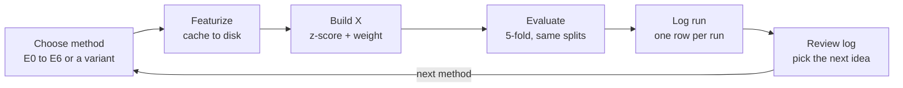

# Playlist Sorter PRD — Phase 1: Song Vectorization

_Last updated: 2026-09-27 · Owner: Ahmad · Scope: Phase 1 only (song → vector experiments)_

## Overview

Phase 1 picks one song-vectorization method to build the Playlist Sorter on, chosen by a measured experiment loop rather than by guess.

The full product will sort ~3,000 Spotify liked songs into existing playlists. Every later step (data matrix, playlist vibes, assignment) depends on how good the song vectors are, so this phase tests several ways to turn a song into a vector **x** and records how well each one predicts which playlist a song belongs to.

**Deliverable:** a written decision naming the winning method (or combination), backed by an experiment log, plus reusable featurization code. That decision becomes the input to the full-project PRD.

## Scope

**In scope**

- Spotify login and a one-time pull of liked songs and playlist memberships (read-only)
- Getting per-song inputs: tags, metadata and 30-second audio clips
- Building song vectors with each candidate method
- A repeatable experiment loop that runs, scores and logs every method
- Light math needed to compare methods fairly: standardization, block weighting, PCA for plots, a nearest-centroid baseline

**Out of scope (full PRD)**

- Writing anything back to Spotify (adding or moving tracks)
- The final assignment model (LDA, Mahalanobis, kNN, label propagation)
- Clustering leftovers into new playlists
- Any UI beyond notebooks and a results table

## Constraints

Spotify no longer provides song features, so every vector must be computed from outside sources.

- **Audio features are gone.** Spotify removed `audio-features`, `audio-analysis` and `recommendations` for new apps on 27 Nov 2024; there is no replacement ([source](https://dev.to/birrings/spotifys-audiofeatures-api-died-in-2024-heres-what-i-built-to-replace-it-3dn3)).
- **Development Mode limits (Feb 2026).** The app owner needs Spotify Premium, one Client ID per developer, max 5 authorized users ([source](https://pypi.org/project/mcp-spotify/0.1.0/)). Fine for a personal tool.
- **Redirect URI** must use `127.0.0.1`, not `localhost` ([source](https://www.endpoint51.com/blog/spotify-api-2026-changes/)).
- **No audio from Spotify.** Clips come from iTunes 30-second previews, which rate-limit at roughly 25 requests per minute, so ~3,000 songs takes about 2 hours of fetching across runs.
- **Local compute only.** Essentia and CLAP must run on a laptop; cache every vector to disk so no song is processed twice.

## Candidate approaches

Eight experiments, run cheapest first; E4 to E6 only run if the single-source methods leave a clear gap.

| ID | Method | Vector x | Dims (approx.) | Needs audio | Linear algebra angle |
| --- | --- | --- | --- | --- | --- |
| E0 | Random baseline | Random Gaussian vector | 64 | No | Sets the chance-level floor every method must beat |
| E1 | Last.fm tags, TF-IDF | Weighted tag counts | 500–2,000 (sparse) | No | Sparse vectors, cosine geometry |
| E1b | Tags + LSA | Truncated SVD of the song × tag matrix | 50–100 | No | SVD merges synonym tags into latent axes |
| E2 | Essentia classifiers | Mood probs (happy, sad, aggressive, relaxed, party), danceability, valence, arousal, genre/style probs | ~410 | Yes | Interpretable axes; block weighting |
| E3 | CLAP audio embedding | Dense audio embedding | 512 | Yes | Dot products with text-prompt directions (e.g. happy minus sad) |
| E4 | Concatenation | [E1b ; E2 ; E3], each block z-scored and scaled by 1/sqrt(block size) | ~670 | Yes | Block weighting so no source dominates |
| E5 | Concatenation + PCA | E4 projected onto top k components | 20–100 | Yes | SVD, explained variance, denoising |
| E6 | Interaction features | E4 plus selected outer-product terms (mood × top genres) | E4 + ~50 | Yes | Outer products are rank 1; test whether they add signal |

## Experiment loop

Each method is a config file run through one script (`run_experiment.py --config e2_essentia.yaml`); only the featurizer changes between runs.



Rules that keep runs comparable:

- **Same data, same splits.** Fix the song set and a random seed once; every run uses the identical 5 folds.
- **Same scorer.** Evaluation is always nearest-centroid with cosine similarity, plus kNN (k = 10) as a second view. The goal here is to compare vectors, not models.
- **One change per run.** A variant (e.g. LSA at 50 vs 100 dims) gets its own run ID such as `E1b-k50`.
- **Cache everything.** Raw inputs and vectors saved as `.npy` / parquet keyed by Spotify track ID; a re-run only recomputes what changed.
- **Log automatically.** The script appends a row to `experiments.csv` and saves a PCA plot per run, so nothing depends on memory.

## Evaluation

A method is judged by how often it puts an already-sorted song back in its own playlist.

**Labeled set.** Songs that already sit in at least one playlist. Playlists with fewer than 10 songs are excluded from scoring (too few to form a centroid). Liked songs not in any playlist are not used for scoring.

**Protocol per fold.** Compute each playlist centroid from the training songs only, then score held-out songs:

$$
\text{score}(x, p) = \frac{x \cdot \mu_p}{\lVert x \rVert \, \lVert \mu_p \rVert}, \qquad \mu_p = \frac{1}{|p|} \sum_{i \in p} x_i
$$

| Metric | What it answers | Primary? |
| --- | --- | --- |
| Top-1 accuracy | Is the best-scoring playlist a correct one? | Yes |
| Top-3 accuracy | Is a correct playlist in the top 3 suggestions (matches a review UI)? | Yes |
| Macro-F1 | Does it work for small playlists too, not just the biggest one? | Secondary |
| Silhouette score (by playlist label) | Do playlists form separated regions in vector space? | Secondary |
| Coverage | Share of liked songs the method can vectorize at all | Gate |
| Cost | Minutes to featurize 3,000 songs; vector size on disk | Tiebreak |

Songs in several playlists count as correct if any of their playlists is predicted. Report every metric as mean ± standard deviation over the 5 folds.

## Experiment log

One row per run, mirrored from `experiments.csv`; add a row for every variant (e.g. `E1b-k50`, `E1b-k100`).

Status values: `Not started` · `Running` · `Done` · `Skipped`

| Run ID | Method | Dims | Coverage (%) | Top-1 (%) | Top-3 (%) | Macro-F1 | Featurize time (min) | Status | Notes |
| --- | --- | --- | --- | --- | --- | --- | --- | --- | --- |
| E0 | Random baseline | 64 | | | | | | Not started | |
| E1 | Last.fm tags, TF-IDF | | | | | | | Not started | |
| E1b | Tags + LSA | | | | | | | Not started | |
| E2 | Essentia classifiers | | | | | | | Not started | |
| E3 | CLAP embedding | 512 | | | | | | Not started | |
| E4 | Concatenation | | | | | | | Not started | |
| E5 | Concatenation + PCA | | | | | | | Not started | |
| E6 | Interaction features | | | | | | | Not started | |

## Data and tooling

Python 3.11, one repo, everything cached locally and keyed by Spotify track ID.

| Need | Tool | Used by |
| --- | --- | --- |
| Spotify auth, library pull | `spotipy` (Authorization Code flow, redirect `http://127.0.0.1:8888/callback`) | All |
| Crowd tags | `pylast` (Last.fm API, free key) | E1, E1b |
| 30-second audio clips | iTunes Search API previews, matched on artist + title | E2 to E6 |
| Mood, genre, danceability models | `essentia-tensorflow` pretrained models | E2 |
| Audio embeddings | LAION-CLAP | E3 |
| Math, models, metrics | NumPy (PCA, centroids written by hand), scikit-learn (to check them), pandas | All |
| Plots | matplotlib | All |

**Repo layout**

```
playlist-sorter/
  data/raw/          # library.json, tags.parquet, audio/<track_id>.m4a
  data/vectors/      # <run_id>.npy + index.csv
  configs/           # e0_random.yaml ... e6_interactions.yaml
  src/fetch/         # spotify.py, lastfm.py, itunes.py
  src/featurize/     # tags.py, essentia_feats.py, clap_feats.py, combine.py
  src/evaluate.py    # folds, centroids, metrics
  run_experiment.py  # loop entry point
  experiments.csv    # the log
  reports/           # PCA plots per run
```

Keep API keys in a `.env` file and out of git.

## Milestones

Five milestones in order; M2 is the gate that proves the loop works before any audio work starts.

1. **M1 — Data pull.** Spotify login works; `library.json` holds every liked song and every playlist membership. Print playlist sizes.
2. **M2 — Loop + baseline (gate).** `run_experiment.py` runs E0 end to end and logs a row. E0 Top-1 should sit near chance; if not, the evaluation has a bug.
3. **M3 — No-audio methods.** E1 and E1b logged, with PCA plots. This is the first real answer.
4. **M4 — Audio methods.** Clips fetched and cached; E2 and E3 logged. Record coverage (songs with no iTunes match).
5. **M5 — Combinations and decision.** E4 to E6 run if needed; write the decision section and start the full-project PRD.

## Decision criteria

Pick the simplest method whose Top-3 accuracy is within one fold standard deviation of the best result.

- **Must beat baseline:** Top-1 at least 2x E0 across all 5 folds.
- **Must cover the library:** coverage of at least 90% of liked songs, or a stated fallback for the rest (e.g. tags when audio is missing).
- **Prefer simple:** among methods that tie, choose fewer sources, then smaller vectors, then faster featurizing.
- **Prefer explainable:** a tie between E2 and E3 goes to E2, because named mood and genre axes make later playlist "vibes" readable.

**Exit:** write a short decision note here (winning run ID, its metrics, why), then start the full-project PRD using that method as the featurizer.

## Open questions and risks

| Risk or question | Why it matters | Mitigation |
| --- | --- | --- |
| How many playlists have 10+ songs? | Too few labeled songs makes every metric noisy | Check at M1; merge or drop tiny playlists from scoring |
| iTunes preview mismatches | Wrong clip = wrong vector for that song | Match on artist + title + duration; log and spot-check 30 matches |
| Obscure songs have few or no Last.fm tags | Lowers E1 coverage | Fall back to artist-level tags; record coverage |
| Playlists defined by era or context, not sound (e.g. "2019 summer") | No audio vector can learn them | Flag these playlists and note them in the log; they may need metadata features in the full PRD |
| Essentia / CLAP install on your machine | Blocks M4 | Test both installs during M1, before they are needed |
| Spotify Dev Mode rules change again | Could break the data pull | Pull the library once and work from the cached `library.json` |