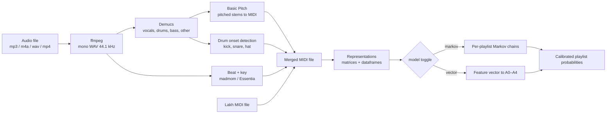

# Spotify Refine — PRD: MIDI Analysis & Symbolic Playlist Classifier

_Last updated: 2026-10-09 · Owner: Ahmad · Repo: [AhmadWali04/Spotify_Refine](https://github.com/AhmadWali04/Spotify_Refine)_

> **Builds on:** `PRD-phase1.md` (song vectorization experiments) and `PRD.md` (full app: vibes, assignment models A0–A4, calibration, review UI, write-back).
> **Adds:** a new featurizer family based on **MIDI** — audio → MIDI → matrices + dataframes → a **Markov model** or the **existing feature-vector models**, switchable by config.
> **Removed from earlier brainstorm:** sheet music / MusicXML. Notation quantization drops timing feel (swing, groove, rubato) that carries genre information; MIDI keeps it.

---

## 1. Overview

Turn any song into MIDI, represent that MIDI as matrices and dataframes you can inspect, and learn which musical patterns (chord progressions, melodic motion, drum grooves) characterize each playlist. A new song then gets a predicted playlist from this symbolic view, which can be used on its own or fused with the existing CLAP/tag predictions.

Two training sources:

1. **Lakh MIDI Dataset (LMD)** — clean MIDI with genre labels, used to develop and validate features and models without transcription noise.
2. **Your own playlists** — audio transcribed to MIDI, used for the real task.

## 2. Goals and non-goals

**Goals**

1. A reproducible **audio → MIDI** pipeline.
2. For every song, a **matrix** output (NumPy) and a **dataframe** output (pandas) that can be inspected by hand.
3. A **model toggle**: `markov` vs `vector` (vector → any of A0–A4 from `PRD.md`), with identical evaluation so results are comparable.
4. Quantify how much transcription noise costs: clean-MIDI accuracy vs transcribed-MIDI accuracy.
5. Register the symbolic featurizer as experiment **E8** in the Phase 1 harness and test fusion with the current best model.

**Non-goals**

- Sheet music, MusicXML or notation rendering
- Music generation
- Lyrics or vocal-timbre analysis
- Real-time transcription

## 3. Success metrics

| Metric | Target | Notes |
| --- | --- | --- |
| LMD genre top-1 accuracy (clean MIDI, 5-fold) | ≥ 2× majority-class baseline | Proves the representation carries genre signal |
| Your playlists, top-3 accuracy (symbolic only) | Above E0 random baseline by ≥ 3× | Symbolic alone is expected to trail CLAP |
| Fusion: symbolic + current best model | Top-3 ≥ current 80 % + 2 points | The real reason to build this |
| Transcription gap | Measured and reported | Clean vs transcribed accuracy on the same LMD songs (synthesized audio) |
| Inspectability | Every song yields matrix + dataframe files in < 1 command | `refine midi inspect` |

## 4. Pipeline



Lakh MIDI files skip transcription and enter at the merged-MIDI step; everything downstream is shared.

### 4.1 Audio → MIDI (FR-M1 to FR-M6)

- **FR-M1:** Decode any input (including `.mp4` audio tracks) to mono 44.1 kHz WAV with `ffmpeg`.
- **FR-M2:** Separate stems with **Demucs** (`htdemucs`); cache stems under `data/stems/<track_id>/`.
- **FR-M3:** Transcribe `bass`, `other` and `vocals` stems with **Basic Pitch**; each stem becomes one MIDI instrument.
- **FR-M4:** Transcribe drums from the drum stem into GM drum notes (36 kick, 38 snare, 42 hi-hat) via band-split onset detection.
- **FR-M5:** Estimate tempo, beat times, downbeats and key; store beat times in the MIDI and in `meta.json`.
- **FR-M6:** Write `data/midi/<track_id>.mid` with `pretty_midi`; never re-transcribe a cached song.

## 5. Representations: matrix and dataframe outputs

Every song produces both forms. Time is measured on the **beat grid** (16th-note steps), not seconds, so tempo doesn't change the representation.

### 5.1 Dataframes (for inspection and following along)

**`notes_df`** — one row per note:

| Column | Type | Example |
| --- | --- | --- |
| `track_id` | str | `3n3Ppam7vgaVa1iaRUc9Lp` |
| `instrument` | str | `bass` |
| `program` | int | 33 |
| `is_drum` | bool | False |
| `pitch` | int (0–127) | 40 |
| `pitch_name` | str | `E2` |
| `pitch_class` | int (0–11, key-normalized) | 4 |
| `start_s`, `end_s` | float | 12.48, 12.96 |
| `start_beat`, `duration_beats` | float | 24.0, 1.0 |
| `bar`, `step_in_bar` | int | 6, 0 |
| `velocity` | int | 92 |

**`beats_df`** — one row per beat: `beat`, `bar`, `chord` (e.g. `Am`), `chord_root`, `chord_quality`, `n_active_notes`, 12 chroma columns `c0`…`c11`, and drum hits `kick`, `snare`, `hat`.

**`summary_df`** — one row per song: tempo, key, mode, note density, pitch range, syncopation, number of unique chords, and the flattened feature vector columns.

### 5.2 Matrices (for the math)

| Name | Shape | Definition |
| --- | --- | --- |
| `piano_roll` | 128 × T | Binary (or velocity) note-on matrix at 16th-note steps |
| `chroma` | 12 × T | `F @ piano_roll`, where F ∈ {0,1}^{12×128} folds octaves |
| `chroma_keynorm` | 12 × T | `chroma` with rows circularly shifted so the tonic is row 0 |
| `chord_seq` | length B | Chord index (0–23 major/minor, 24 = no chord) per beat |
| `chord_trans` | 25 × 25 | Counts of chord i → chord j; row-normalize to get a Markov matrix |
| `pc_trans` | 12 × 12 | Melodic pitch-class transitions (top voice of `other` / `vocals`) |
| `interval_hist` | 25 | Melodic interval histogram, −12…+12 semitones |
| `drum_grid` | 3 × 16 | Mean kick/snare/hat activation per 16th step across bars |
| `drum_grid_var` | 3 × 16 | Variance of the same, i.e. how much the groove changes |
| `ssm` | Bars × Bars | Cosine self-similarity of bar-level chroma (song structure) |
| `chroma_dft_mag` | 7 | Magnitude of DFT over the 12 pitch classes of mean chroma (transposition-invariant) |

**Chord estimation:** per beat, score 24 templates (major/minor triads) against beat-averaged chroma by cosine similarity; label "no chord" if the best score is below τ_chord.

**Key normalization:** detected key → circular shift of chroma rows (a 12×12 permutation matrix). For LMD, use the key signature when present, else the Krumhansl–Schmuckler profile correlation.

### 5.3 Inspection command

```
refine midi inspect path/to/song.mp3      # or a .mid file
```

Writes to `data/inspect/<track_id>/`:

- `notes.csv`, `beats.csv`, `summary.csv`
- `matrices.npz` (all matrices above)
- `piano_roll.png`, `chroma.png`, `chord_trans.png`, `drum_grid.png`, `ssm.png`
- `transcribed.mid` (for listening back in any DAW)

It also prints the first 10 rows of `notes_df`, the detected key/tempo, and the top 5 chord transitions. A companion notebook `notebooks/midi_walkthrough.ipynb` loads one song and steps through each representation.

## 6. Modeling: the toggle

Both models implement one interface so the harness and app don't care which is active:

```python
class SymbolicModel(Protocol):
    def fit(self, songs: list[SongRep], labels: list[set[str]]) -> None: ...
    def predict_proba(self, songs: list[SongRep]) -> np.ndarray: ...  # n × |P|
```

Selected in `configs/symbolic.yaml`:

```yaml
model: markov            # markov | vector
markov:
  sequences: [chords]    # any of: chords, pitch_classes, drums
  order: 1               # 1 or 2
  alpha: 0.5             # Laplace smoothing
  weights: {chords: 1.0, pitch_classes: 0.5, drums: 0.5}
vector:
  assignment_model: A2   # A0 | A1 | A2 | A3 | A4 (from PRD.md)
  blocks: [chord_trans, pc_trans, interval_hist, drum_grid, chroma_dft_mag, scalars]
augment:
  transpose: true        # 12x circular shifts at train time (vector mode, pre-normalization)
```

CLI override: `refine eval --symbolic-model markov` or `--symbolic-model vector --assignment A2`.

### 6.1 Markov mode (generative)

For each playlist p and sequence type s, pool transitions across the playlist's training songs:

$$
P_{p,s}(j \mid i) = \frac{n_{p,s}(i \to j) + \alpha}{\sum_k n_{p,s}(i \to k) + K_s\,\alpha}
$$

where K_s is the alphabet size (25 chords, 12 pitch classes, 8 drum-step states). Score a song by length-normalized log-likelihood, combined across sequence types:

$$
\ell_p(\text{song}) = \sum_s w_s \cdot \frac{1}{T_s}\sum_{t} \log P_{p,s}(x_{t+1} \mid x_t) + \log \pi_p
$$

π_p is the playlist prior (size-proportional or uniform, configurable). Order 2 uses state pairs (25² = 625 states) and needs heavier smoothing.

**Explainability output:** for the predicted playlist, list the 5 transitions in the song with the largest log-ratio log P_p − log P_background. This feeds the app's "why" view (e.g. "vi → IV and IV → I are 4× more common in your Indie playlist").

### 6.2 Vector mode (discriminative)

1. Flatten each block in `blocks`; row-normalize transition matrices first.
2. Z-score each column, then scale each block by 1/√(block size) (same rule as Phase 1).
3. Pass X to the chosen assignment model from `PRD.md` §7.2 (A0–A4).
4. Optional: PCA to k components before A1/A2 when d is large (`chord_trans` alone is 625 dims).

### 6.3 Calibration and fusion

- Both modes output scores that go through the existing **temperature scaling** step, so probabilities are comparable.
- **Fusion (E9):** p_final = softmax(w₁ log p_symbolic + w₂ log p_current), weights fit on held-out folds by minimizing NLL.

## 7. Datasets

| Dataset | Use | Notes |
| --- | --- | --- |
| **LMD-matched** (~45k MIDI matched to the Million Song Dataset) | Develop features, compare models on clean MIDI | Lakh itself has no genre labels |
| **tagtraum genre annotations (CD2 / CD2c)** for MSD | Genre labels for LMD-matched songs | Join on MSD track ID; use the ~10–15 top-level genres |
| **Your playlists** (audio previews / own files) | The real task | Same 5 folds as the Phase 1 harness |
| **LMD songs synthesized to audio** (FluidSynth + a GM soundfont) | Measure transcription gap | Run synthesized audio through §4.1 and compare with the original MIDI |

**LMD prep:** drop files < 30 s or with no beat information; dedupe multiple MIDI versions per MSD track (keep the highest match score); cap each genre at a fixed count to limit class imbalance; record the subset in `data/lmd/subset.csv`.

## 8. Experiments

New rows in `experiments.csv`, same harness, same metrics (top-1, top-3, macro-F1, NLL, ECE):

| ID | Data | Model | Purpose |
| --- | --- | --- | --- |
| S0 | LMD | Majority class + random | Floor |
| S1 | LMD | Markov, chords, order 1 | Baseline generative model |
| S2 | LMD | Markov, chords + pitch classes + drums | Does rhythm/melody help? |
| S3 | LMD | Markov, order 2 | Longer context vs sparsity |
| S4 | LMD | Vector + A0 / A2 / A3 | Discriminative comparison |
| S5 | LMD | S4 with vs without transposition augmentation | Value of key invariance |
| S6 | LMD synth audio | Best of S1–S5 on transcribed MIDI | Transcription gap |
| E8 | Your playlists | Best symbolic config | Symbolic-only accuracy |
| E9 | Your playlists | Fusion E8 + current best | Does it improve the app? |

Every run logs its config (including `model` toggle value) and git hash.

## 9. App integration

- **FR-M7:** "Analyze a song" page: upload audio or `.mid`, show piano roll, chord sequence, drum grid, predicted playlists with probabilities, and the Markov "why" transitions (or top-weighted features in vector mode).
- **FR-M8:** Download buttons for `notes.csv`, `beats.csv`, `matrices.npz` and `transcribed.mid`.
- **FR-M9:** Model toggle in the UI (Markov / Vector + assignment model) for side-by-side comparison on the same song.
- **FR-M10:** New endpoints under the existing Flask API: `POST /api/midi/analyze`, `GET /api/midi/<track_id>/notes`, `GET /api/midi/<track_id>/matrices`, `GET /api/midi/<track_id>/predict?model=markov`. Transcription runs as a background job with progress, like the existing pipeline jobs.

## 10. Repo additions

```
Spotify_Refine/
  configs/symbolic.yaml
  src/midi/
    transcribe.py       # ffmpeg, Demucs, Basic Pitch, drum onsets
    beats_key.py        # tempo, beats, downbeats, key
    represent.py        # notes_df, beats_df, summary_df, all matrices
    chords.py           # template-based chord estimation
    inspect.py          # `refine midi inspect`
  src/models/symbolic/
    base.py             # SymbolicModel protocol
    markov.py           # Markov mode + explanations
    vector.py           # flatten, block weighting, wraps A0–A4
  src/data/lakh.py      # LMD-matched + tagtraum join, subset builder
  notebooks/midi_walkthrough.ipynb
  tests/test_represent.py   # e.g. chroma = F @ piano_roll; transposition invariance of DFT magnitudes
  tests/test_markov.py      # rows sum to 1; likelihood on toy sequences
  data/midi/  data/stems/  data/inspect/  data/lmd/   (gitignored)
  PRD-midi.md
```

## 11. Milestones

Continues numbering from `PRD.md` (M6–M12).

1. **M13 — Representations on clean MIDI.** Load one LMD file → `notes_df`, `beats_df`, all matrices, plots. Unit tests pass. _Done when:_ `refine midi inspect song.mid` works.
2. **M14 — LMD dataset.** LMD-matched + tagtraum joined, cleaned, balanced subset saved. _Done when:_ genre counts printed and subset frozen with 5 folds.
3. **M15 — Markov mode.** S1–S3 logged with explanations. _Done when:_ S1 beats S0 by the §3 target.
4. **M16 — Vector mode + toggle.** S4–S5 logged; switching `model:` in config changes nothing else. _Done when:_ both modes report through the same harness.
5. **M17 — Audio → MIDI.** Transcription pipeline cached and working; S6 measures the transcription gap. _Done when:_ 10 spot-checked songs sound recognizably correct as MIDI.
6. **M18 — Your playlists.** E8 and E9 logged. _Done when:_ fusion decision made (keep or drop symbolic features).
7. **M19 — App integration.** FR-M7 to FR-M10 shipped. _Done when:_ a new song can be analyzed end to end from the UI.

## 12. Risks

| Risk | Impact | Mitigation |
| --- | --- | --- |
| Transcription errors on dense mixes | Wrong notes/chords → noisy features | Demucs stems first; chord estimation on beat-averaged chroma is robust to a few wrong notes; measure via S6 |
| LMD genre labels are noisy and imbalanced | Misleading LMD accuracy | Use top-level tagtraum genres, cap per-class counts, report macro-F1 |
| Your playlists differ by timbre, not harmony | Symbolic accuracy stays low | Expected; judge success by fusion gain (E9), not E8 alone |
| Order-2 Markov sparsity | Overconfident or flat scores | Stronger smoothing; interpolate with order 1; calibrate |
| Key detection mistakes | Key normalization shifts songs wrongly | Also test `chroma_dft_mag` (key-free) and transposition augmentation |
| Demucs / Basic Pitch runtime on a laptop | Slow processing of the full library | Cache aggressively; 30 s previews; batch overnight |

## 13. Open questions

1. Which tagtraum label set (CD2 vs CD2c) and how many genres?
2. Should vocals be transcribed, or dropped as too noisy for melody features?
3. Full tracks from your own files vs 30 s previews for your playlists?
4. Should Markov mode also model bass-note sequences separately from chords?